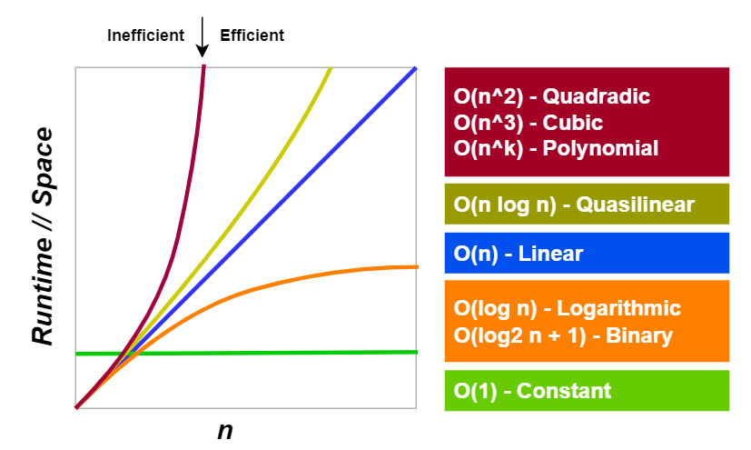

# Topic 2: Big O

Because each problem has its own larger context, there is no single way to pick the best algorithm for a task. Instead, we compare different algorithms looking for ones that balance time & space complexities in the most useful way. For example, what good is a blazing fast algorithm if it requires more space than is available? Big O helps us describe, compare, and select algorithms.  

## What is Big O?

Technically, Big O is the theoretical definition of the complexity of an algorithm as a function of its size.

In layman's terms, **Big O** (sometimes called the **upper bound**) is how we notate an algorithm's worst-case performance as the size of a data set increases. 

* Big O describes both time & space complexities. 
* Big O describes both individual steps & entire algorithms - the complexity of an algorithm is the the complexity of its least efficient step. 
* Most importantly, we use Big O to compare the relative performance of different algorithms that solve the same problem. 

The **O** in Big O stands for **order of growth**. When you plot various complexities like the image above, you're visually comparing their orders of growth. 

## Time, Space, and *n*

**Time complexity** is a worst-case measure of how long an algorithm takes to complete as the size of the data set grows. ***Runtime*** is how we abstract time - it's the number of operations an algorithm performs. 

**Space complexity** is a worst-case measure of how much additional memory an algorithm needs as the size of the data set grows. 

***n*** is a combination data point - it represents a worst-case where the number of operations equals the number of values in a dataset. 

For example, say the task is to guess a random letter. Here, ***n*** is 26 because there are 26 letters in the alphabet and in the worst case, you would need 26 guesses. 
